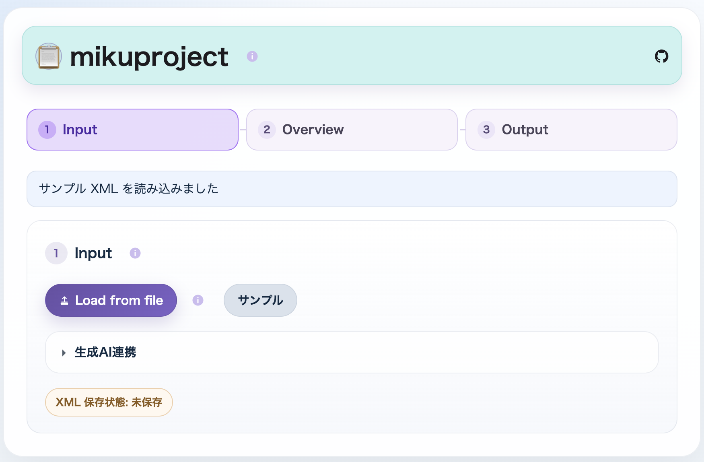

# miku-project-web



GitHub: https://github.com/igapyon/miku-project-web

`miku-project-web` は、[`miku-project`](https://github.com/igapyon/miku-project) の browser-compatible runtime を固定して利用する single-file Web App です。browser adapter、UI、`lht-cmn`、browser/UI test、Web 配布物をこの repository で管理します。core、Node.js CLI、browser runtime の生成と公開は `miku-project` が担当します。

配布物 `miku-project.html` は、検証済み runtime と Web assets を build 時に内包します。browser 実行時に GitHub や runtime asset へ接続しません。

## Build

Node.js 20 以上を使用します。

```bash
npm ci
npm run build
npm test
npm run test:offline
```

通常の build は [runtime lock](runtime/miku-project-runtime.lock.json) に固定された GitHub Release asset を取得し、SHA-256 と version を検証します。一度検証した runtime は `.cache/runtime/` に保存されます。

未公開 runtime を組み合わせて開発するときだけ、同じ SHA-256 を持つローカルファイルを明示できます。

```bash
MIKU_PROJECT_RUNTIME_FILE=/path/to/miku-project-runtime.mjs npm run verify
```

この override は検証を迂回しません。lock の SHA-256 と version に一致しないファイルは拒否されます。

## Ownership

- この repository: HTML source、Web UI TypeScript/JavaScript、CSS、`lht-cmn`、browser/UI test、single-file build
- `miku-project`: core source、CLI、browser runtime bundle、runtime Release
- repository-local lock: upstream Release tag、asset 名、package version、SHA-256 の境界

詳細は [Architecture](docs/architecture.md)、[Runtime intake](docs/runtime-intake.md)、[Development](docs/development.md)、[Verification record](docs/verification.md) を参照してください。

## License

Apache License 2.0。vendor notices は [THIRD-PARTY-NOTICES.md](THIRD-PARTY-NOTICES.md) と [`lht-cmn`](lht-cmn/) を参照してください。
